## 🧑‍🎓 학우 간 배달 앱 "학우야 배달 해줘"

### 목차

------

[TOC]

### 개요

------

교내에서 배달 음식을 먹고 싶은 학생들의 고민이 있다. "배달비가 비싸다는 것"

그렇기 때문에 교내 학식을 선택하거나 교외로 나가는 번거로움이 생긴다.

교외 학우들은 수업을 들으러 교내로 들어와야 된다.

"**어차피, 수업을 들으러 교내로 들어올텐데, 포장 음식을 배달하면 어떨까?**"란 생각으로 시작했다.

### 기능

| 기능                                                         |
| ------------------------------------------------------------ |
| 회원가입(Positive)                                           |
| 회원가입(Negative, 도메인 불일치 case)                       |
| 회원가입(Negative, DB 중복 존재 case)                        |
| 로그인(Positive)                                             |
| 로그인(Negative, DB 유저 정보 미발견 case)                   |
| 배달 요청글 작성 및 대기(Positive)                           |
| 배달 요청글 작성 및 대기(Negative, User의 부적합한 Status case) |
| 배달 요청 수락(Positive)                                     |
| 배달 요청 수락(Negative, User의 부적합한 Status case)        |
| 배달 종료(Positive)                                          |

### 인터페이스

------

  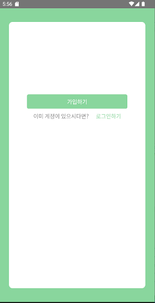
  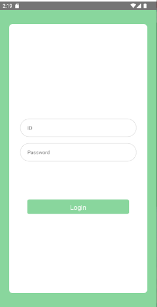
  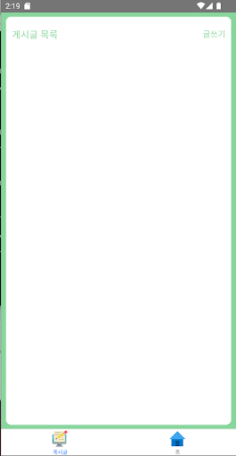
  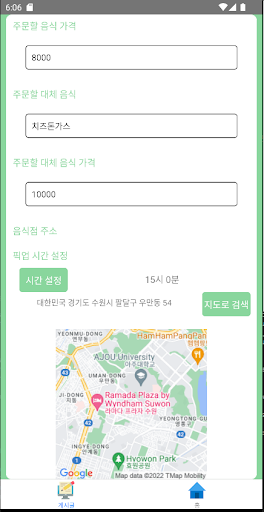
  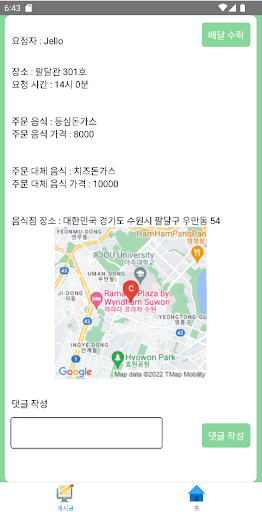
  

## 📃 설계

### 시스템 구조

------

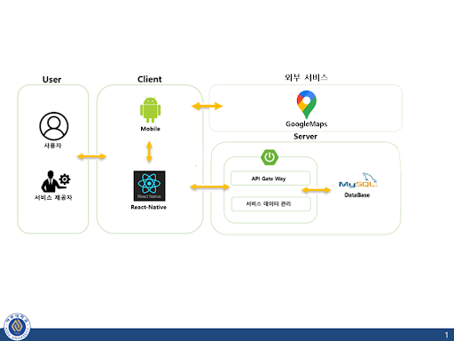

### Sequence Diagram

------

 
로그인
 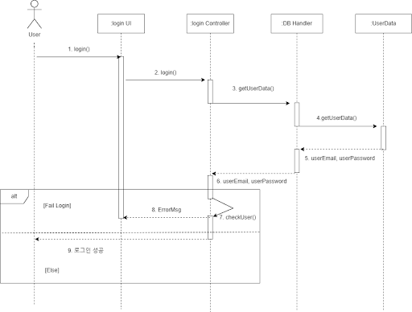 

 
회원가입
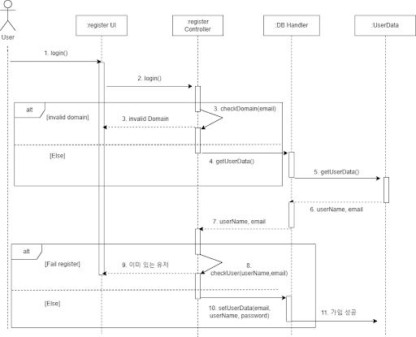

 
게시글 작성
 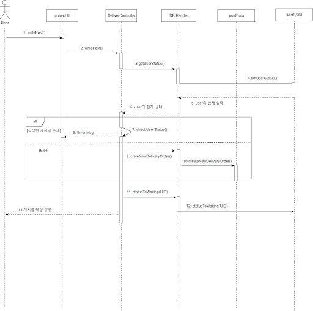 

 
배달 수락
 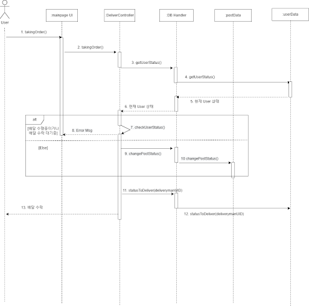 

 
배달 종료
 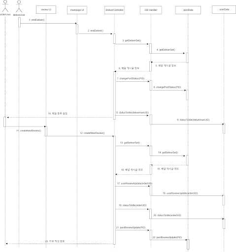 

### UseCase Diagram

------

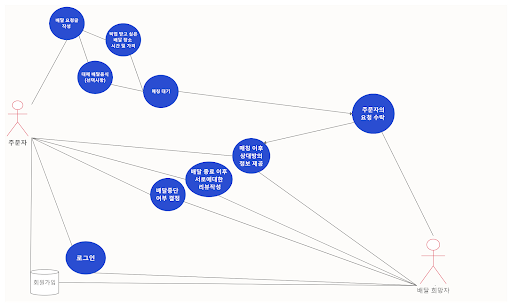

### Class Diagram

------

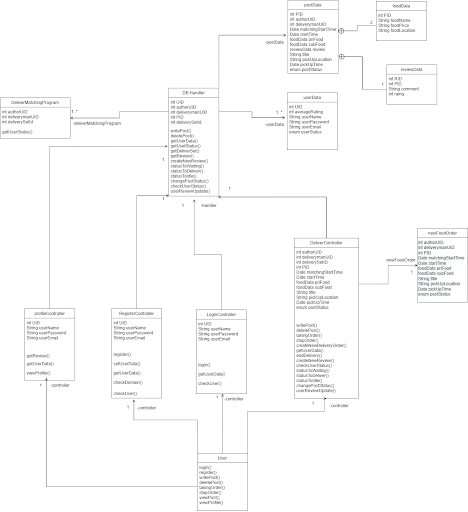

### Architetural Design

------

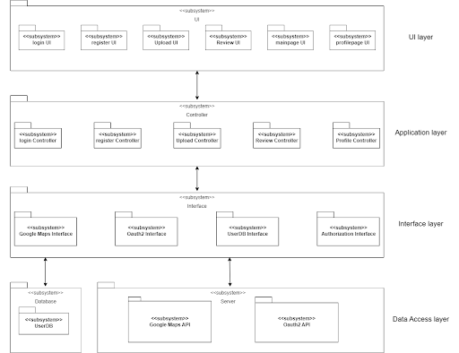
